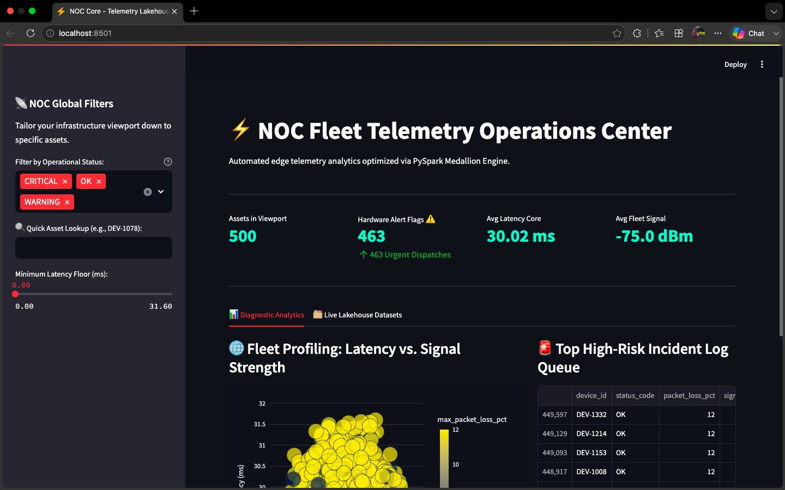
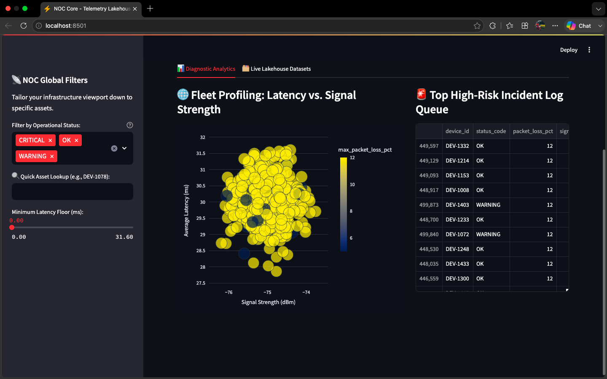
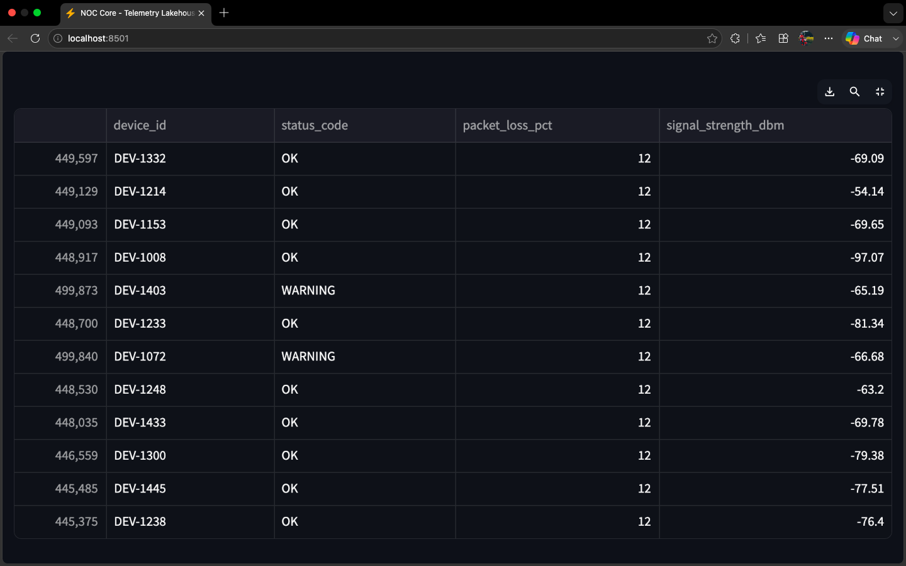

# ⚡ Telecom Telemetry Ingestion Pipeline & NOC Dashboard

An enterprise-grade, end-to-end data engineering platform that ingests, transforms, profiles, and serves massive streams of cellular and network device telemetry. Built using a **Medallion Lakehouse Architecture**, this system processes over 500,000 concurrent network logs in under a minute using localized multi-threaded Apache Spark workers, exposing the resulting gold-layer metrics through a high-performance Network Operations Center (NOC) dashboard.

## 🏗️ Architecture Overview

The platform implements a structured data lakehouse methodology to optimize storage footprint, preserve data lineage, and enforce strict analytical performance boundaries:

1. **Bronze Layer (Raw Ingestion):** Ingests volatile network performance logs containing raw hardware measurements (Signal strength in dBm, latency, and packet drops).
2. **Silver Layer (Cleanse & Enrich):** Leverages PySpark to drop corrupted payloads, cast schema typing, and compute high-risk alert flags. Data is persisted to disk using columnar **Apache Parquet**, dynamically partitioned by `status_code` to allow downstream engines to leverage **partition pruning**.
3. **Gold Layer (Business Aggregates):** Computes rolling fleet matrices, mapping hardware health profiles, maximum packet loss boundaries, and average operational latencies per asset.
4. **Serving Layer (Interactive Dashboard):** A responsive Streamlit application backed by Plotly Express, streaming directly from the cached Gold storage layer for instantaneous network diagnostic profiling.

---

## 🛠️ Tech Stack & Frameworks

* **Data Processing Core:** Apache Spark (PySpark v3.5+)
* **Distributed Storage Blueprint:** Apache Parquet (Columnar, Partitioned)
* **Serving Layer Frontend:** Streamlit
* **Interactive Visualization:** Plotly Express
* **Compute Environment:** Python 3.12.2 / Java JDK 21 (LTS) Baseline

---

## 🚀 Performance Metrics & Optimization Inversions

* **High Throughput:** Processes and restructures **500,000 complex telemetry records in ~51 seconds** utilizing local thread allocations (`local[*]`).
* **Storage Footprint Reduction:** Transitioning from row-oriented raw storage to columnar Parquet achieved massive compression benefits alongside lightning-fast schema discovery.
* **Catalyst Optimization Proofing:** Built-in Spark SQL views validate structural data constraints before analytical runs, utilizing partition pruning to bypass redundant directories (e.g., completely skipping `status_code=OK` when targeting critical platform failures).

---

## 📂 Repository Blueprint

```text
telecom-telemetry-pipeline/
├── data/
│   ├── raw/                 # Incoming telemetry source streams (.csv)
│   └── processed/           # Compressed Parquet storage tables
│       ├── detailed_telemetry/  # Silver layer partitioned by status_code
│       └── device_profiles/     # Gold layer hardware asset aggregates
├── src/
│   ├── process_telemetry.py # Core PySpark ETL pipeline routine
│   └── query_lakehouse.py   # Analytical Spark SQL query validation script
├── app.py                   # Streamlit NOC Interactive UI
├── requirements.txt         # Package dependency manifest
├── .gitignore               # System environment and data isolation boundaries
└── README.md                # System documentation
```

⚙️ Execution & Deployment Guide
1. Prerequisites & Environment Setup
This platform targets a stable Java 21 Long-Term Support (LTS) environment to avoid reflection mapping warnings common in modern vector-incubating runtimes.

```Bash
# Explicitly point environment mapping to Java 21 LTS
export JAVA_HOME=$(/usr/libexec/java_home -v 21)

# Clear legacy option overlays to ensure a stable cluster spin-up
unset JDK_JAVA_OPTIONS

# Initialize and source virtual environment
python3 -m venv venv
source venv/bin/activate
pip install -r requirements.txt
```
2. Run the Ingestion Pipeline (ETL)
Execute the core PySpark engine to transform raw streams into the partitioned storage layers:

```Bash
python3 src/process_telemetry.py
```
3. Run Lakehouse SQL Queries
Query the Silver and Gold storage layers directly via the localized Spark SQL compilation engine:

```Bash
python3 src/query_lakehouse.py
```
4. Launch the NOC Operations Dashboard
Spin up the presentation layer to interactively filter and monitor device fleet health metrics in real-time:

```Bash
streamlit run app.py
```
